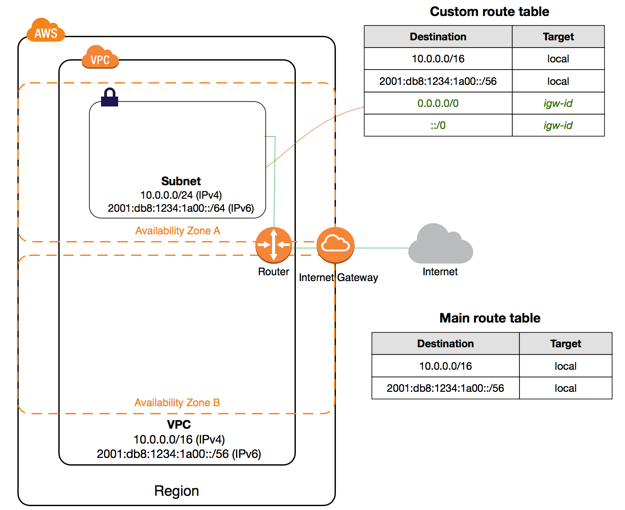
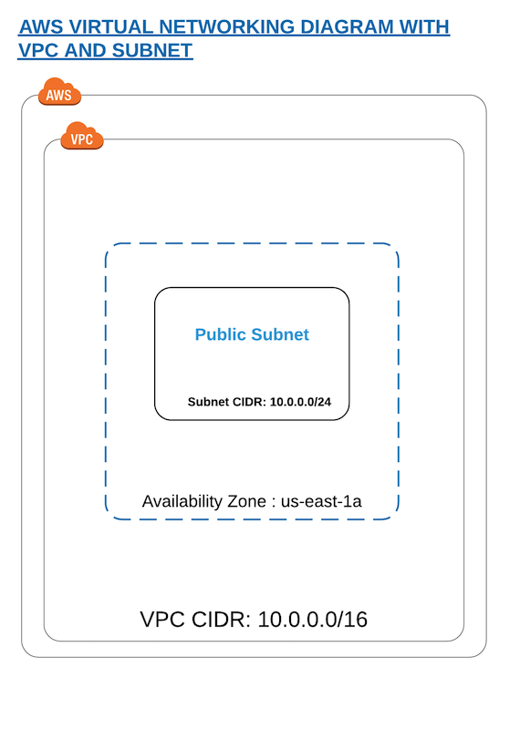

Create
------

The diagram below depicts the reference architecture of a virtual private network with associated resources.

This document will focus on the implementation of this architecture in AWS.

By the end of this guide you should have a working local Gyro environment and deployed below given resources on AWS cloud :

1. Virtual private cloud network (VPC)
2. Subnet
3. Route Table
4. Internet gateway

Configuration
+++++++++++++

The first step to creating infrastructure with gyro is to define the init config file which has
details about your project such as plugins, credentials, global variables and backend file systems.

Inside your project folder, start by creating a `gyro` directory and run the ``gyro init <plugins>``
to create the init file with the required plugins. You can also run ``gyro help init`` for detailed
usage of this command.

You also need to add the project specific details in the  ``init.gyro`` configuration file such as
credentials which will allow gyro to create resources on cloud.

.. code:: shell

    $ /usr/local/bin/gyro init gyro:gyro-aws-provider:0.15-SNAPSHOT

    + Creating a new .gyro directory
    + Writing to the .gyro/init.gyro file

After generating th init.gyro config file, create a resource file named vpc.gyro with the following configuration :

.. code::

    aws::vpc vpc-example
        cidr-block: "10.0.0.0/16"

        tags: {
            Name: "vpc-example"
        }
    end

    aws::subnet subnet-public-us-east-2a
        vpc: $(aws::vpc vpc-example)
        cidr-block: "10.0.0.0/26"
        availability-zone: "us-east-2a"

        tags: {
            Name: "subnet-public-us-east-2a"
        }
    end

VPC
+++

aws::vpc - The name of the resource which will be used by gyro to identify the VPC resource.

cidr-block - The IPv4 network range for the VPC, in CIDR notation

Subnet
++++++

aws::subnet - The name of the resource which will be used by gyro to identify the subnet resource.

vpc-id : The ID of the VPC to create the subnet in, which in this case would be the vpc-example.

cidr-block : The IPv4 network range for the subnet, in CIDR notation.

availability-zone : The name of the availablity zone to create this subnet.

The above given configuration would be creating a VPC resource and a subnet associated to that network as depicted in the diagram below :

Launching Infrastructure
++++++++++++++++++++++++

Now that the infrastructure configuration is defined, it is ready to launch. Run gyro up
``vpc.gyro``, you can also pass ``--verbose`` flag to get additional details of the resource. When
``y`` is given at the prompt, resource state file gets generated under here
``.gyro/state/vpc.gyro``.

You should see output similar to the following :

.. code:: shell

  $ /usr/local/bin/gyro up vpc.gyro

   ↓ Loading plugin: gyro:gyro-aws-provider:0.15-SNAPSHOT
   ↓ Loading plugin: gyro:gyro-brightspot-plugin:0.15-SNAPSHOT
   ⟳ Refreshed resources: 0

   Looking for changes...

   + Create aws::vpc vpc-example
   + Create aws::subnet subnet-public-us-east-2a

   Are you sure you want to change resources? (y/N) y

   + Creating aws::vpc vpc-example OK
   + Creating aws::subnet subnet-public-us-east-2a OK
